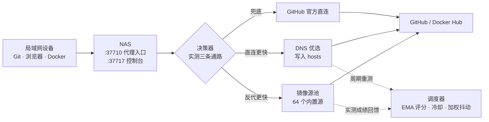

<p align="center">
  <br/>
  <b>Dog-dev 加速器</b><br/>
  让闲置的飞牛 NAS 当局域网 GitHub / Docker 加速跳板<br/><br/>
  
  
  <a href="LICENSE"></a>
  <a href="https://github.com/MisiteQ/github-plus-plus"></a>
</p>

<p align="center">
  <a href="#快速开始">快速开始</a> ·
  <a href="#工作原理">工作原理</a> ·
  <a href="#功能一览">功能一览</a> ·
  <a href="#默认端口">默认端口</a> ·
  <a href="#接入方式">接入方式</a> ·
  <a href="#隐私与安全">隐私与安全</a> ·
  <a href="#卸载与数据">卸载与数据</a>
</p>

---

fnOS 加速 FPK：**Git 克隆 / 网页浏览 / Release 与 raw 下载 / Docker 拉取** 四条链路全部经 NAS 中转。出厂内置 **64 个 GitHub 加速源** 与 **14 个 Docker 上游**，运行期持续测速自动择优、故障源自动冷却换源；用「直连 / 反代 / hosts 优选」三条通路的实测成绩决定走哪条，慢链路自动让位、直连恢复自动切回。Docker 加速依赖 **kspeeder 应用**（自动探测其安装与运行状态，接入端口跟随 kspeeder 自身配置）。Go 单二进制 + 内嵌 iOS 风格控制台，**默认不影响 NAS 与局域网其他设备的正常联网**。

## 快速开始

| # | 做什么 | 说明 |
|:--|:--|:--|
| 1 | 构建 FPK | `./scripts/build-fpk.sh x86`（arm64 用 `arm`），产物在 `dist/` |
| 2 | 应用中心 → 手动安装 | 入口被关闭时先在 NAS 上执行 `appcenter-cli manual-install enable` |
| 3 | 打开 `http://<NAS 地址>:37717` | 默认账号 `admin` / `admin123`，**登录后请立即修改** |
| 4 | 把客户端指过来 | Git / 浏览器 / Docker 三种接法见 [接入方式](#接入方式) |

> [!NOTE]
> 服务后台常驻：关窗口、登出飞牛账号都不中断；进程异常退出时看门狗 3 秒自动拉起（`rc=0` 视为主动停止）。启停在总览页，「崩溃自动重启」开关在「设置 → 后台运行」。

## 工作原理



代理引擎按 Host 判断请求是否属于 GitHub，分类为**网页 / 裸文件 / 仓库传输**后，由调度器选出当前最快的源改写目标 URL 并流式转发，失败自动换源重试。接入形态两种：**显式代理**（客户端把 HTTP 代理指到本机）与**透明反代**（hosts 把 GitHub 域名指到 NAS，Host 头即域名）。

## 功能一览

| 能力 | 说明 |
|:--|:--|
| **四链路加速** | Git clone / pull / push、网页浏览（免证书）、Release / raw / codeload 等 **15 个 GitHub 域名**下载、Docker 拉取（认证地址与 302 跳转始终经本机） |
| **智能择优** | 64 个内置源持续测速：EMA 评分随时间衰减 · 连续失败进冷却 · 前列源加权抖动防扎堆；全部可在控制台增删改权重、添加私有源 |
| **通路决策** | 实测「直连 / 反代 / hosts」三条通路，首字节延迟为主、吞吐为辅，不稳定通路罚分；直连快速熔断 + 半开恢复 + 启动预热 |
| **DNS 优选** | 多公共 DNS 收集候选 IP（绕过本地污染）→ TCP + TLS + 首字节测速 → 写 hosts 命中优质节点；512KB 吞吐探针识别运营商 QoS，慢链路自动切镜像 |
| **KSpeeder 依赖** | 自动探测本机 kspeeder 应用（安装/版本/运行态），运行时其 registry 列为 Docker 上游第一优先，接入端口完全跟随 kspeeder 自身配置；控制台 Docker 页有节点面板，未安装时给下载链接 |
| **hosts 安全** | 只替换自己注释标记之间的区块，写前备份、写后校验、出错回滚，尊重用户已有条目 |
| **MITM 可选** | 需要更彻底时用本地 CA 为 GitHub 域名签发证书；私钥仅本机 `0600`，只签 GitHub 相关域名 |
| **Web 控制台** | 总览 / 加速源 / DNS / Docker / 应用 / 日志 / 设置 / 关于 8 页，浅色 / 深色 / 跟随系统三态主题，实时日志与测速 |

## 默认端口

| 端口 | 用途 |
|:--|:--|
| `37717` | Web 控制台（应用中心「打开」与桌面图标都指向它） |
| `37710` | 代理入口：显式代理、hosts 透明反代、Docker `registry-mirrors` |

> [!NOTE]
> 默认监听 `0.0.0.0`，仅供局域网使用。应用以 **root** 运行（hosts 加速需写 `/etc/hosts`）。控制台默认口令 `admin123` 仅作首次登录，**请立即修改**；忘记可在 NAS 上执行 `ghpp -reset-password` 重置。kspeeder 应用的端口（默认 5443/5003）由该应用自己配置，本应用不占用、也不修改。

## 接入方式

把 `<NAS 地址>` 换成 NAS 的 IP（总览页有现成地址可复制；NAS 本机一律填 `127.0.0.1`）。

**① Git / curl：显式代理**

```bash
git clone http://<NAS 地址>:37710/https://github.com/git/git.git

# Release 文件
curl -LO "http://<NAS 地址>:37710/https://github.com/jqlang/jq/releases/download/jq-1.7.1/jq-linux-amd64"

# raw 文件
curl -LO "http://<NAS 地址>:37710/https://raw.githubusercontent.com/git/git/master/README.md"
```

**② 浏览器：hosts 模式（免证书）**

控制台开启 hosts 模式，程序优选 IP 写入 hosts 全局生效；想更彻底可开 MITM 模式，客户端需装一次根证书（控制台「证书」页下载）。

**③ Docker：镜像加速**

```json
{
  "registry-mirrors": ["http://127.0.0.1:37710"]
}
```

局域网其他设备把 `127.0.0.1` 换成 NAS 地址；也可直接在飞牛 Docker 界面的「镜像源」里填。

## 隐私与安全

- 仅在局域网监听，**不对外网暴露**；流量只经 NAS 中转，不上传任何数据到第三方
- 加速通道是社区公益服务，程序只做透明反代，**不缓存、不篡改、不注入**任何内容
- MITM 根证书只装在你自己的设备上，不要外传；不需要时用 hosts 模式即可全局加速
- hosts 写入只动自己标记的区块，前后均有备份与校验，出错立即回滚

## 卸载与数据

| 内容 | 位置 | 卸载时 |
|:--|:--|:--|
| 程序与打包载荷 | `/vol1/@appcenter/dog-dev` | 随应用删除 |
| 运行数据（配置 / 证书 / 日志 / 1.1.x 引擎归档目录） | `/vol1/@appdata/dog-dev` | 依飞牛惯例回收，**需要保留请先自行备份** |
| hosts 托管区 | `/etc/hosts` 中带标记的一小段 | 停止服务时清理，`uninstall_init` 兜底再清一次 |

> [!WARNING]
> 若曾开启 hosts 模式，卸载后确认 `/etc/hosts` 无残留 GitHub 域名条目（程序自己写的在 `Dog-dev` 注释标记区块内，可整段删掉）。

## 仓库结构

```
manifest          飞牛应用清单（版本 / 显示名 / 端口 / 权限）
fpk/              打包模板 + 生命周期脚本（cmd/ 安装卸载启停、app/watchdog.sh）
cmd/ghpp/         程序入口（-data / -proxy / -web / -reset-password / -clear-hosts）
internal/         proxy（反代 / MITM / Docker Registry / 本地 CA）· mirror（源测速与择优）·
                  decide（三通路决策）· dnsopt（DNS 优选）· hostsfile · km（KSpeeder 依赖探测）
web/              内嵌控制台（Vue3 源码在 web/ui，构建产物直出 web/static）
scripts/          build-fpk.sh 等构建打包脚本
```

## 从源码构建

需要 Go 1.24+ 与 [fnpack](https://developer.fnnas.com/docs/cli/fnpack/)：

```bash
./scripts/build-fpk.sh x86    # 交叉编译 + 打 x86 FPK
./scripts/build-fpk.sh arm    # 交叉编译 + 打 arm64 FPK
```

产物在 `dist/`。本仓库是 [MisiteQ/github-plus-plus](https://github.com/MisiteQ/github-plus-plus) 的 fork（Dog-dev），上游原版 README 保留在 `README.upstream.md`。

## 📄 许可证

本项目遵循 [MIT License](LICENSE) 许可证。上游作者 **MisiteQ**；本仓库在其基础上新增 KSpeeder 依赖探测、64 加速源、pathfetch 源类型、Vue3 控制台等改动，构成 [MisiteQ/github-plus-plus](https://github.com/MisiteQ/github-plus-plus) 的衍生作品。

---

## 🙏 致谢

- [MisiteQ/github-plus-plus](https://github.com/MisiteQ/github-plus-plus) —— 上游项目作者，全部核心实现
- 社区公益加速通道提供者（ghproxy.net、ghfast.top、gh-proxy.com 等）
- [KSpeeder](https://kspeeder.com) —— Docker 拉取加速的依赖应用
- [EWEDLCM/FnDepot](https://github.com/EWEDLCM/FnDepot) —— 飞牛应用源客户端，可添加作者源一键安装与升级
- [飞牛 fnOS](https://www.fnnas.com/) —— 提供友好的 NAS 操作系统体验

---

<div align="center">

**如果觉得好用，顺手点个 ⭐ Star 支持一下！**

</div>
