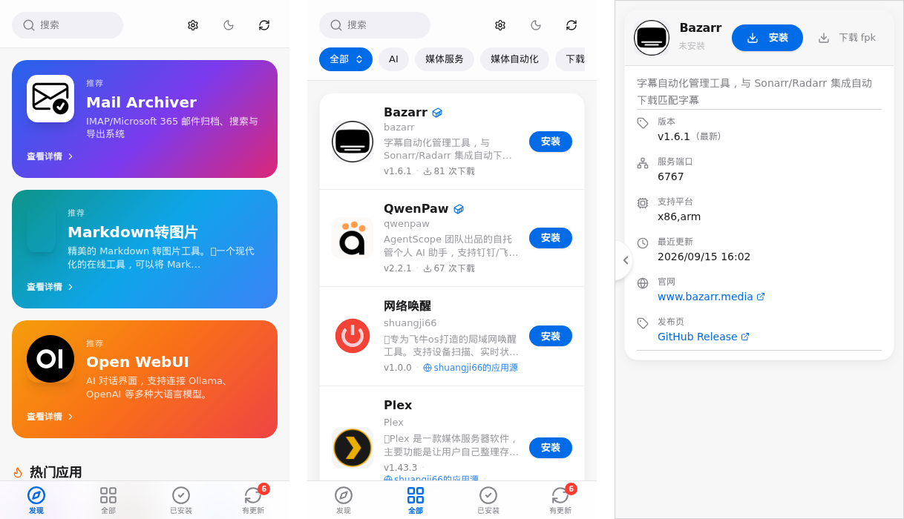

# 🏬 New Store

飞牛 fnOS 的第三方应用中心：App Store 式界面浏览、安装、更新 455+ 第三方应用（FPK 与 Docker 双通道），内置 GitHub / Docker 智能镜像监测，装完只用一个入口（38011）访问。

<div align="center">

[](https://github.com/Blue-Mink/New-Store/releases/tag/v1.21.1)
[](#)

</div>

| 项目 | 信息 |
| :--- | :--- |
| 👨‍💻 **打包维护** | [Blue-Mink](https://github.com/Blue-Mink) |
| 📁 **原项目** | [New-Store](https://github.com/Blue-Mink/New-Store)（基础版本 [conversun/fnos-store](https://github.com/conversun/fnos-store)）　·　原版收录见 [fnos-apps-store/](../fnos-apps-store/README.md) |
| 📥 **安装方式** | 下载 [new-store_1.21.1_x86.fpk](https://github.com/Blue-Mink/FnDepot/releases/download/new-store-v1.21.1/new-store_1.21.1_x86.fpk)（[sha256](fpk.sha256)）在 fnOS 应用中心手动安装；装好后在本应用「设置」里添加本源即可自助更新 |
| 🏷️ **版本** | v1.21.1（`appname = fnos-apps-store`，端口 38011；本版上游仅发 x86 FPK，arm64 只出二进制） |
| 🌐 **入口端口** | 38011（应用中心「打开」与桌面图标直达） |
| 🔧 **依赖** | 无（纯 Go 单二进制 + 内嵌前端，不需要 Docker / 虚拟机） |

## 特性

- **App Store 式界面**：发现（随机推荐/热门/最近更新）、全部（分类 + 搜索）、已安装、有更新四分区；PC 侧栏 + 移动端底部 dock 双端布局，可嵌入飞牛 App
- **后台下载任务**：「下载 fpk」解耦到服务端后台任务，关闭页面不中断；支持**暂停 / 继续**（`.part` Range 断点续传），详情页按钮三态联动，通知栏顶部居中、4 秒自动收起
- **智能镜像监测**：GitHub 12 个代理源 + Docker 8 个镜像源每 5 分钟自动探测，下载链按健康度排序，`auto` 智能模式一次命中最快源，连续 3 败自动持久化切换
- **KSpeeder 本地源**：检测到 iStoreOS iStoreEnhance 本地镜像（:5443）时 Docker 拉取优先走本地
- **官方应用中心直连**：设置里填面板账号即可同步 355 个官方应用并走官方 cloud 下载/安装通道（安装前列出实时依赖，可选跳过已有同名应用）
- **一键安装 / 更新 / 卸载**：FPK 走应用中心官方流程（含向导），Docker 走 compose；SSE 实时进度、可取消、失败可重试
- **源管理**：FnDepot V1 / V2 + GitHub Release 目录，自定义源增删、单源手动同步、源折叠 / 每源开关 / 自动监测
- **更新检测**：版本比较 + 发布日期四级回退，「有更新」角标一键更新；自更新跨源取最高版本 + 版本门槛防降级
- **同名去重**：按 FPK SHA256 内容级去重，详情页展示大小 / 哈希对比
- **徽章体系**：列表 / 详情统一蓝框徽章（源 / 开发者 / 发布者），行内可点筛选

## 安装

1. 下载上方链接的 FPK（本版仅 x86）
2. 应用中心 → 手动安装（无向导，纯二进制）；已装旧版直接覆盖安装，数据保留
3. 应用中心「打开」或桌面图标进入 `http://<NAS 地址>:38011/`
4. 点「立即检查」同步全部应用源（约 1~3 分钟），之后每 3 小时自动检查更新

> 提示：本应用是应用中心本体。首次安装需手动装 FPK；装好后在 New Store「设置 → 应用源」里添加本源（https://github.com/Blue-Mink/FnDepot），后续即可在应用内直接检查并更新自身。

## 近期版本

| 版本 | 要点 |
| :--- | :--- |
| [v1.21.1](https://github.com/Blue-Mink/New-Store/releases/tag/v1.21.1) | 下载后台任务化 + 暂停/继续（断点续传）+ 顶部通知栏；修复任务系统自死锁、重启后通知栏刷旧任务 |
| [v1.20.16](https://github.com/Blue-Mink/New-Store/releases/tag/v1.20.16) | 图标换 Card Stack「CS-3D A70 柔光」方案（四档槽位）；无功能变更 |
| [v1.20.0](https://github.com/Blue-Mink/New-Store/releases/tag/v1.20.0) | 官方应用中心直连（面板账号）+ 官方 cloud 安装通道，同名应用折叠 |

## 校验

```
4c8fd287be455fe926f38be7ad18dc4940c6328d9bdd0aa312a9ace7d4ecce5f  new-store_1.21.1_x86.fpk
```

## 预览

| 发现 | 全部 | 移动端 |
| :---: | :---: | :---: |
|  |  |  |

## 源码

完整源码见 [source/](source/)（与 [New-Store](https://github.com/Blue-Mink/New-Store) 仓库提交 `09093c8` 逐字节一致，git tree `2042e953e73da4594b42e37d7b318abcde3cc7c1`），`bash build.sh` 可复现 FPK。
