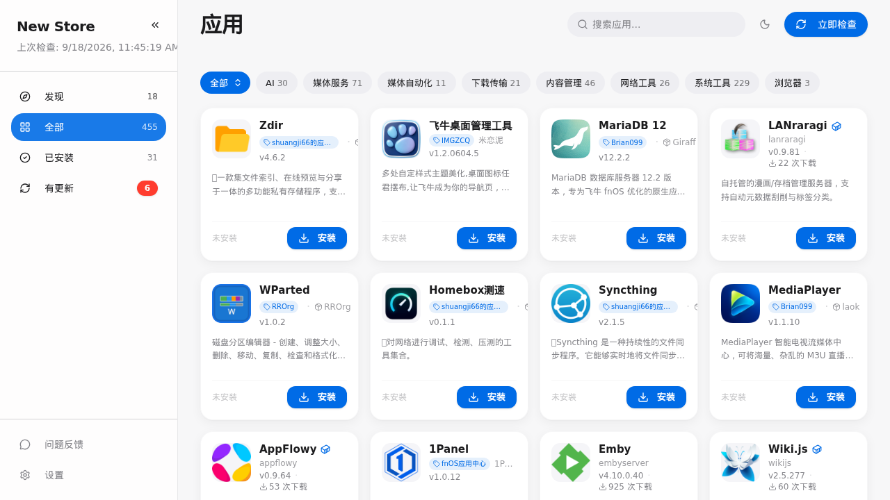
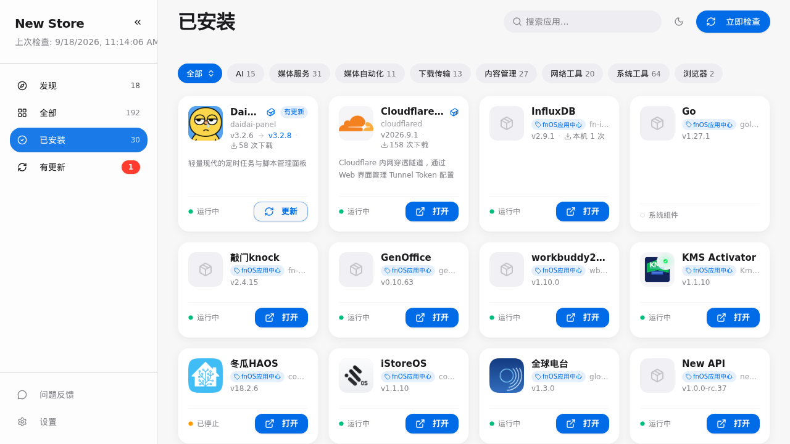

# 🏬 New Store

飞牛 fnOS 的第三方应用中心：App Store 式界面浏览、安装、更新 455+ 第三方应用（FPK 与 Docker 双通道），内置 GitHub / Docker 智能镜像监测，装完只用一个入口（38011）访问。

| 项目 | 信息 |
| :--- | :--- |
| 👨‍💻 **打包维护** | [Blue-Mink](https://github.com/Blue-Mink) |
| 📁 **原项目** | [New-Store](https://github.com/Blue-Mink/New-Store)（基础版本 [conversun/fnos-store](https://github.com/conversun/fnos-store)） |
| 📥 **安装方式** | 下载 [new-store_1.19.5_x86.fpk](https://github.com/Blue-Mink/FnDepot/releases/download/new-store-v1.19.5/new-store_1.19.5_x86.fpk)（[sha256](https://github.com/Blue-Mink/FnDepot/releases/download/new-store-v1.19.5/new-store_1.19.5_x86.fpk.sha256)）或 [arm 版](https://github.com/Blue-Mink/FnDepot/releases/download/new-store-v1.19.5/new-store_1.19.5_arm.fpk)（[sha256](https://github.com/Blue-Mink/FnDepot/releases/download/new-store-v1.19.5/new-store_1.19.5_arm.fpk.sha256)）在 fnOS 应用中心手动安装；装好后在本应用「设置」里添加本源即可自助更新 |
| 🏷️ **版本** | v1.19.5（端口 38011；1.19.4 起由 8011 迁移） |
| 🌐 **入口端口** | 38011（应用中心「打开」与桌面图标直达） |
| 🔧 **依赖** | 无（纯 Go 单二进制 + 内嵌前端，不需要 Docker / 虚拟机） |

## 特性

- **App Store 式界面**：发现（随机推荐/热门/最近更新）、全部（分类 + 搜索）、已安装、有更新四分区；PC 侧栏 + 移动端底部 dock 双端布局，可嵌入飞牛 App
- **智能镜像监测**：GitHub 12 个代理源 + Docker 8 个镜像源每 5 分钟自动探测，下载链按健康度排序，`auto` 智能模式一次命中最快源，连续 3 败自动持久化切换
- **KSpeeder 本地源**：检测到 iStoreOS iStoreEnhance 本地镜像（:5443）时 Docker 拉取优先走本地
- **一键安装 / 更新 / 卸载**：FPK 走应用中心官方流程（含向导），Docker 走 compose；SSE 实时进度、可取消
- **源管理**：FnDepot V1 / V2 + GitHub Release 目录，自定义源增删、死链超时与失败记忆
- **更新检测**：版本比较 + 发布日期四级回退，「有更新」角标一键更新
- **同名去重**：按 FPK SHA256 内容级去重，详情页展示大小 / 哈希对比

## 安装

1. 下载上方链接的 FPK（x86 / arm 按机型选）
2. 应用中心 → 手动安装（无向导，纯二进制）
3. 应用中心「打开」或桌面图标进入 `http://<NAS 地址>:38011/`
4. 点「立即检查」同步全部应用源（约 1~3 分钟），之后每 3 小时自动检查更新

> 提示：本应用是应用中心本体。首次安装需手动装 FPK；装好后在 New Store「设置 → 应用源」里添加本源（https://github.com/Blue-Mink/FnDepot），后续即可在应用内直接检查并更新自身。

## 预览

| 发现 | 全部 | 已安装 |
| :---: | :---: | :---: |
|  |  |  |

## 源码

完整源码见 [source/](source/)（与 [New-Store](https://github.com/Blue-Mink/New-Store) 仓库 v1.19.5 tag 一致），`bash build.sh` 可复现双平台 FPK。
