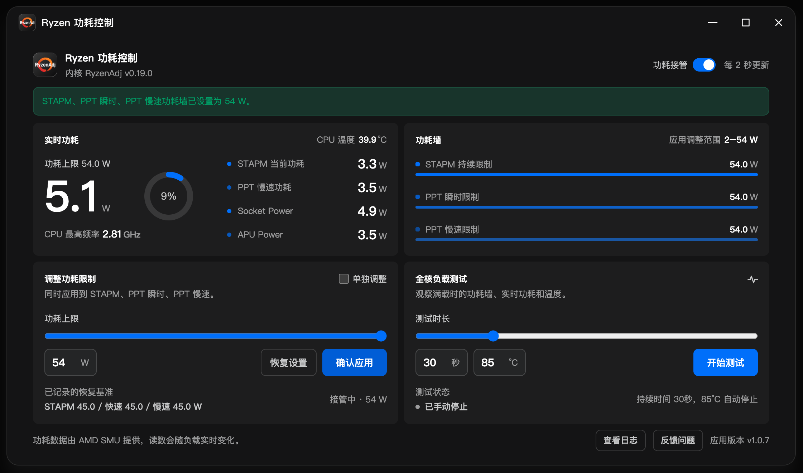

# ⚡ Ryzen 功耗控制（ryzen-power-control）— fnOS 应用包

> 本项目是 [**LANMIN-X/RyzenAdj-for-fnOS**](https://github.com/LANMIN-X/RyzenAdj-for-fnOS) 的 **fnOS 应用中心打包版本（fpk）**，收录上游官方 FPK 原包（未重打包、字节未改）与完整源码快照。
>
> 🎯 **原作者项目**：[LANMIN-X/RyzenAdj-for-fnOS](https://github.com/LANMIN-X/RyzenAdj-for-fnOS)
> 📦 **原作者 Release**：[官方 releases](https://github.com/LANMIN-X/RyzenAdj-for-fnOS/releases)

## 当前版本

| | |
|---|---|
| 包版本 | **v1.0.7** |
| FPK | [ryzen-power-control-1.0.7.fpk](https://github.com/Blue-Mink/FnDepot/releases/download/ryzen-power-control-v1.0.7/ryzen-power-control-1.0.7.fpk) |
| SHA256 | `b7638f503333fd6c068cd8bb1b24cd9ce1020f0aee2b85c4d20eb4664fb45281` |
| 运行方式 | 原生（root，`/dev/mem` + ryzen_smu 驱动自动修复） |
| 平台 | fnOS x86_64（要求 fnOS ≥ 1.1.3100） |

## 功能简介

- 读取处理器功耗墙（STAPM / PPT Fast / PPT Slow）、实时功耗与温度
- 设置 / 恢复功耗限制，写入后回读校验，不一致不保存
- 30 / 60 / 120 秒全核负载测试，可手动停止，温度到阈值自动停止（默认 85°C，可设 40–95°C）
- ryzen_smu 驱动缺失或不兼容时自动编译重新加载，仍失败才回退 `/dev/mem`
- 界面跟随 fnOS 系统亮暗主题；运行日志 24 小时自动清理
- 支持 Ryzen 2000 APU 至 Ryzen 9000HX / AI Max 300 / Z1 / Z2 等（以 RyzenAdj 实际识别为准）

## 源码

`source/` 目录为上游仓库 v1.0.7 的完整镜像（55 个文件，含 `app/`、`cmd/`、`config/`、`manifest`、`tests/` 与 ryzen_smu 驱动源码）。

详见 [source/README.md](source/README.md)。
